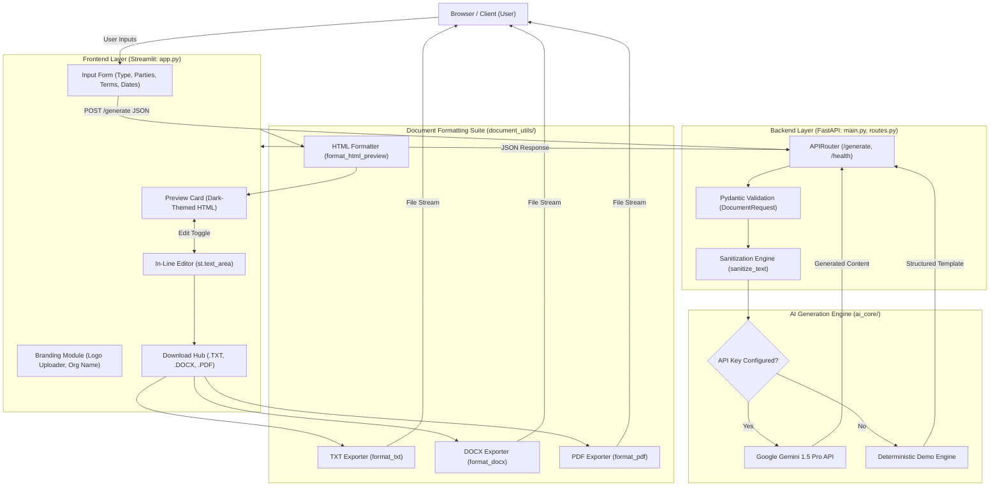
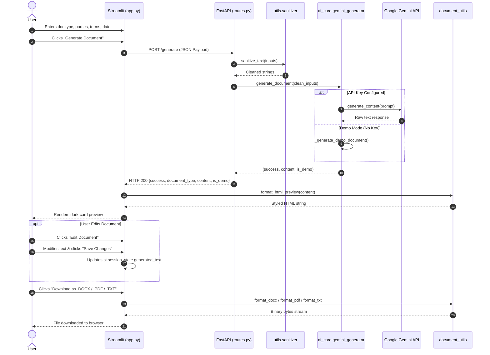

# 1. System Architecture Design — LegalEase

This document specifies the technical architecture, component decomposition, data flow diagrams (DFD), and runtime sequence diagrams for LegalEase.

---

## 1. High-Level Architectural Diagram



---

## 2. Component Decomposition

1. **Frontend Layer (`app.py`)**:
   - Manages UI components, state (`st.session_state`), and user interactions.
   - Dispatches HTTP requests to the FastAPI backend or triggers direct in-process generation if the server is starting.
   - Coordinates file downloads using in-memory byte streams (`io.BytesIO`).

2. **Backend API Layer (`main.py`, `routes.py`)**:
   - Built on FastAPI with ASGI server Uvicorn.
   - Enforces CORS policies, routing, and lifecycle logging.
   - Validates request payloads with Pydantic (`DocumentRequest`).

3. **AI Core Layer (`ai_core/gemini_generator.py`)**:
   - Configures the `google-generativeai` SDK.
   - Implements anti-hallucination prompt construction and negative constraints.
   - Houses the deterministic mock engine for zero-configuration Demo Mode.

4. **Document Formatting Layer (`document_utils/`)**:
   - `txt_generator.py`: Generates UTF-8 encoded plain text with capitalized headers.
   - `docx_generator.py`: Assembles Microsoft Word files with Times New Roman typography, 1-inch margins, signature tables, and footers.
   - `pdf_generator.py`: Builds multi-page PDFs using `fpdf2` with running headers, footers, and page numbers.
   - `formatter.py`: Converts markdown text to semantic, dark-themed HTML preview elements.

5. **Utility Layer (`utils/`)**:
   - `sanitizer.py`: Normalizes typographic quotes, removes control characters, and neutralizes XSS vectors.
   - `config.py`: Loads environment variables and provides central configuration access.

---

## 3. Data Flow Diagram (DFD Level 1)

```
[User] ──(1. Submit Inputs)──► [Frontend] ──(2. JSON Request)──► [Input Sanitizer]
                                                                        │
                                                                 (3. Clean Strings)
                                                                        ▼
[User] ◄──(7. Download Binary)── [Exporters] ◄──(6. Edited Text)── [Pydantic Validator]
                                     ▲                                  │
                                     │                           (4. Valid Model)
                              (5. Draft Text)                           ▼
                                     └────────────────────────── [AI / Demo Engine]
```

---

## 4. Runtime Sequence Diagram


