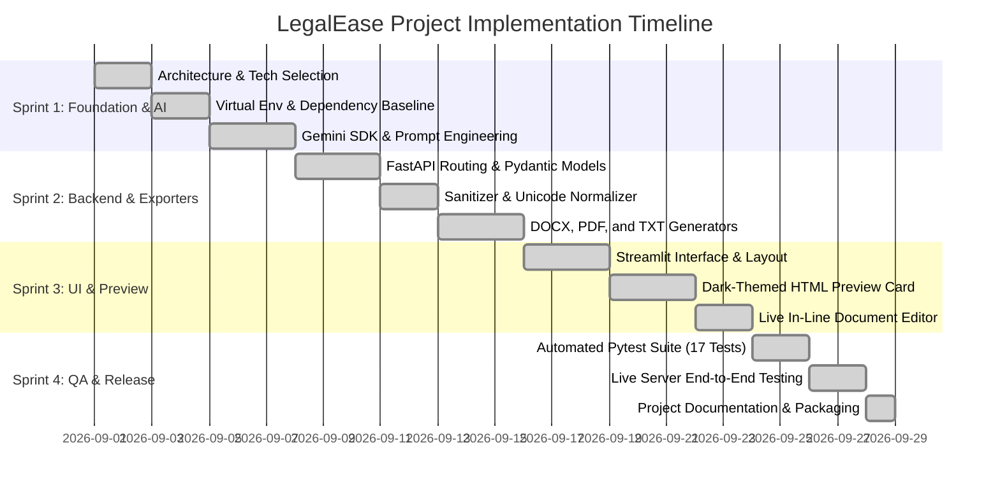

# 2. Sprint Plan & Development Timeline — LegalEase

This document details the Agile development sprints, task allocation, milestones, and project timeline for LegalEase.

---

## 1. Project Timeline & Sprints Overview

The project was executed across four structured sprints following Agile Scrum principles:

```
Sprint 1: Architecture, Environment & AI Core Setup
├── Duration: Week 1
├── Goal: Establish virtual environment, configuration, and Gemini AI integration.
└── Deliverables: venv, .env.example, utils/config.py, ai_core/gemini_generator.py

Sprint 2: Backend REST Routing & Document Exporters
├── Duration: Week 2
├── Goal: Develop FastAPI endpoints, sanitization pipeline, and file export suite.
└── Deliverables: main.py, routes.py, docx_generator.py, pdf_generator.py, txt_generator.py

Sprint 3: Streamlit Frontend & Interactive Document Preview
├── Duration: Week 3
├── Goal: Build responsive UI, sample presets, dark-card preview, and live editor.
└── Deliverables: app.py, assets/logo/ generation, custom CSS styling, download triggers

Sprint 4: Automated Testing, Quality Assurance & Documentation
├── Duration: Week 4
├── Goal: Author 17 automated tests, execute end-to-end browser verification, write documentation.
└── Deliverables: tests/ suite, pytest.ini, README.md, Repository Lifecycle Phases (1 - 8)
```

---

## 2. Sprint Execution Gantt Chart



---

## 3. Milestones & Delivery Sign-Off

| Milestone | Target Date | Description | Status |
| :--- | :--- | :--- | :--- |
| **M1: Architecture & Model** | 2026-09-08 | Selection of Gemini 1.5 Pro and modular folder design. | Completed |
| **M2: Core Utilities** | 2026-09-16 | Text sanitization, DOCX, and PDF generators operational. | Completed |
| **M3: Backend API** | 2026-09-18 | FastAPI endpoints `/generate` and `/health` passing tests. | Completed |
| **M4: Streamlit Frontend** | 2026-09-24 | Reactive UI with preview, editor, and download buttons. | Completed |
| **M5: Testing & QA** | 2026-09-28 | 100% test pass rate across 17 unit and integration tests. | Completed |
| **M6: Final Documentation** | 2026-09-29 | Full 8-phase repository structure and user manuals. | Completed |
